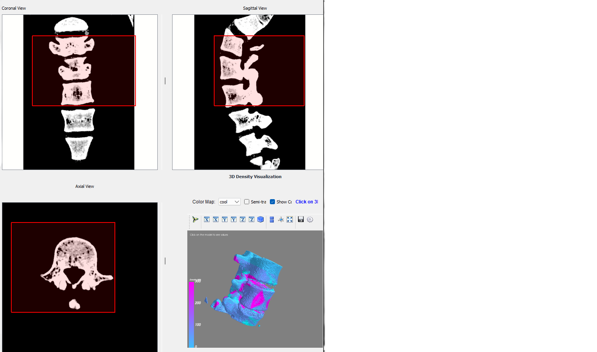

# Patient-Specific 3D Model Generation for Preoperative Planning

A comprehensive medical imaging application developed as part of an MSc thesis in Biomedical Engineering, enabling surgeons to create patient-specific 3D bone models from CT scans for enhanced preoperative planning and surgical training.

## Screenshots

## 🎓 Academic Background

This software was developed as the core component of a Master's thesis in **Biomedical Engineering** with the topic:

**"Patient-Specific 3D Model Generation for Preoperative Planning"**

### Research Context

Preoperative planning is highly critical in every aspect of modern surgery. Patient-specific anatomical modeling through the use of 3D printing has emerged as a valuable tool to enhance surgical planning and training. This thesis presents software in Python (with PyQt) which converts DICOM formatted images from CT scans into detailed three-dimensional models, thus ensuring easier surgical planning.

### Clinical Collaboration

The tool was designed in **close collaboration with an Orthopaedic Department** and orthopedic surgeons will use it for:
- **Bone fracture cases**
- **Arthroplasties** 
- **Deformity corrections**

Surgeons reported that 3D printed models significantly help them visualize challenging fracture patterns and plan procedures like pedicle screw placement preoperatively.

### Key Innovation

One of the most valuable features is the software's ability to **automatically calculate and display bone density**, allowing surgeons to gain better insights into bone strength characteristics for surgical planning.

## Features

### 🖼️ Multi-planar Image Viewing
- **Orthogonal Views**: Simultaneous coronal, sagittal, and axial slice viewing
- **Interactive Navigation**: Scroll through slices with synchronized scrollbars
- **Real-time ROI Synchronization**: Draw ROI in one view and see it automatically projected to other views

### 🎛️ Advanced Image Processing
- **Windowing Controls**: Medical-grade windowing with presets (Bone, Soft Tissue, Lung, Brain, etc.)
- **Threshold Processing**: Adjustable threshold for tissue segmentation
- **Contrast Enhancement**: Real-time contrast adjustment
- **Filtering Options**: Gaussian and median filtering for noise reduction

### 🦴 3D Visualization & Analysis
- **Interactive 3D Models**: Generate 3D bone models with real-time rotation and zoom
- **Density Color Mapping**: Multiple colormaps showing bone density variations
- **Interactive Density Probing**: Click on 3D model to get exact Hounsfield Unit (HU) values
- **Material Properties**: Realistic bone rendering with customizable transparency

### 📊 Medical Data Analysis
- **DICOM Support**: Full DICOM series loading and metadata extraction
- **ROI-based Analysis**: Extract and analyze specific anatomical regions
- **Density Statistics**: Automatic calculation of min/max/mean/median density values
- **Real-time Processing**: Apply processing parameters and see immediate results

### 💾 Export Capabilities
- **STL Export**: Export 3D models for 3D printing and CAD applications
- **Real-Size Models**: Generates anatomically accurate models based on patient dimensions
- **3D Printing Ready**: Optimized for transparent materials to visualize internal structures
- **Clinical Scale**: Tested with medium bone fractures up to 30 cm dimensions
- **Processed Data**: Export with applied windowing, thresholding, and ROI selections

### Application Interface


### System Flowchart


### 3D Printed Result


## Installation

### Prerequisites
- Python 3.10 or higher (3.10 recommended)
- Anaconda or Miniconda (recommended for Mayavi dependencies)
- OpenGL support for 3D visualization

### Setup Instructions (Recommended - Conda)

1. **Clone the repository**
   ```bash
   git clone https://github.com/yourusername/3D-Bone-Segmentation.git
   cd 3D-Bone-Segmentation
   ```

2. **Create conda environment**
   ```bash
   conda create -n bone3d python=3.10 -y
   conda activate bone3d
   ```

3. **Install Mayavi and VTK via conda-forge**
   ```bash
   conda install -c conda-forge mayavi vtk pyqt -y
   ```

4. **Install remaining dependencies**
   ```bash
   pip install -r requirements.txt
   ```

5. **Run the application**
   ```bash
   # On Windows, you may need to set QT_PLUGIN_PATH
   python main.py
   ```

### Alternative Setup (pip only)
Note: pip installation of Mayavi may fail on Windows due to VTK build issues.

1. **Create virtual environment**
   ```bash
   python -m venv venv
   
   # On Windows:
   venv\Scripts\activate
   
   # On macOS/Linux:
   source venv/bin/activate
   ```

2. **Install dependencies**
   ```bash
   pip install -r requirements.txt
   ```

3. **Run the application**
   ```bash
   python main.py
   ```

## Usage

### Loading Medical Data
1. **Import Dataset**: Use "Import CT|MRI Dataset" button or File menu
2. **Select DICOM Series**: Choose from multiple series if available
3. **Navigate Slices**: Use scrollbars to explore different anatomical planes

### ROI Analysis
1. **Draw ROI**: Right-click and drag in any view to create Region of Interest
2. **Automatic Sync**: ROI automatically appears in other orthogonal views
3. **Clear ROI**: Use "Clear ROI" button to remove current selection

### Image Processing
1. **Windowing**: Select medical presets or use custom center/width values
2. **Thresholding**: Adjust threshold slider and click "Apply Threshold"
3. **Filtering**: Choose Gaussian or Median filter with appropriate kernel size

### 3D Visualization
1. **Build 3D Model**: Click "Build 3D" to generate interactive 3D visualization
2. **Interactive Analysis**: Click on model surface to see density values
3. **Customize Display**: Change colormaps, transparency, and view settings
4. **Export**: Use "3D to STL" for 3D printing or further analysis

## Technical Specifications

### Clinical Requirements
- **Anatomical Accuracy**: Real-size model generation based on patient anatomy
- **Surgical Planning**: Designed for preoperative visualization and planning
- **Material Optimization**: STL files optimized for transparent 3D printing materials
- **Size Constraints**: Tested and validated for bone fractures up to 30 cm dimensions

### Supported Formats
- **DICOM**: Single files and complete series from CT scanners
- **NIfTI**: .nii and .nii.gz files
- **Export**: STL format optimized for medical 3D printing

### Performance Features
- **Automatic Downsampling**: Optimizes large datasets for real-time interaction
- **Memory Management**: Efficient handling of large medical datasets
- **Multi-threaded Processing**: Responsive UI during intensive operations
- **Real-time Feedback**: Immediate visualization of processing parameters

### Medical Standards
- **Hounsfield Units**: Proper HU value handling and bone density calculation
- **Medical Colormaps**: Clinically appropriate visualization schemes
- **DICOM Compliance**: Full metadata preservation and utilization
- **Clinical Validation**: Developed in collaboration with orthopedic surgeons

## Project Structure

```
3D-Bone-Segmentation/
├── main.py                           # Application entry point
├── pyproject.toml                    # Modern Python project configuration
├── setup.py                          # Package installation script
├── requirements.txt                  # Python dependencies
├── README.md                         # This file
├── LICENSE                           # MIT License
├── src/                              # Source code directory
│   └── bone_segmentation/            # Main package
│       ├── __init__.py               # Package initialization
│       ├── core/                     # Core processing modules
│       │   ├── __init__.py
│       │   └── image_processing.py   # Medical image processing utilities
│       ├── ui/                       # User interface modules
│       │   ├── __init__.py
│       │   ├── main_window_init.py   # Main UI initialization
│       │   ├── main_window_functions.py  # Core application logic
│       │   ├── image_viewer.py       # Multi-planar image display
│       │   └── windowing_tool.py     # Medical windowing controls
│       └── visualization/            # 3D visualization modules
│           ├── __init__.py
│           ├── mayavi_widget.py      # 3D visualization component
│           └── enhanced_mayavi_widget.py  # Advanced density visualization
├── tests/                            # Test suite
│   ├── __init__.py
│   └── test_core.py                  # Core module tests
├── docs/                             # Documentation
├── scripts/                          # Utility scripts
│   └── run_app.py                    # Application launcher script
└── data/                             # Sample CT data (not in repo)
```

## Dependencies

### Core Libraries
- **SimpleITK**: Medical image processing and DICOM handling
- **NumPy/SciPy**: Scientific computing and image analysis
- **PyQt5**: Professional GUI framework
- **Mayavi/VTK**: Advanced 3D visualization
- **scikit-image**: Image processing algorithms

See `requirements.txt` for complete dependency list with versions.

## Research Impact & Future Work

### Clinical Validation
Initial use cases have shown encouraging results, with surgeons reporting significant improvements in:
- **Fracture Pattern Visualization**: Better understanding of complex fracture geometries
- **Preoperative Planning**: Enhanced surgical approach planning
- **Pedicle Screw Placement**: Improved accuracy in spinal procedures
- **Training Applications**: Educational value for surgical residents

### Future Research Directions
Based on clinical feedback and technological advances, future improvements aim to:
- **Enhanced Segmentation**: Implement machine learning algorithms for automated bone segmentation
- **AI Integration**: Develop automated fracture detection and classification
- **Extended Applications**: Expand beyond orthopedics to other surgical specialties
- **User Experience**: Improve workflow efficiency based on surgeon feedback
- **Validation Studies**: Conduct comprehensive clinical trials to quantify benefits

## Contributing

Contributions are welcome! This project is particularly suitable for:
- **Biomedical Engineers**: Medical device development and clinical applications
- **Medical Imaging Researchers**: Advanced segmentation and visualization techniques
- **Computer Vision Developers**: Machine learning applications in medical imaging
- **Clinical Collaborators**: Surgeons and medical professionals providing clinical insights
- **Healthcare Technology Students**: Learning medical software development

### Development Setup
1. Fork the repository
2. Create feature branch (`git checkout -b feature/clinical-enhancement`)
3. Commit changes (`git commit -m 'Add clinical feature'`)
4. Push to branch (`git push origin feature/clinical-enhancement`)
5. Open Pull Request

## Academic Citation

If you use this software in your research or clinical work, please cite:

```
Dawit F Welegebriel. "Patient-Specific 3D Model Generation for Preoperative Planning." 
MSc Thesis, Biomedical Engineering, University of Patras, 2024.
```

## Medical Disclaimer

This software was developed as part of academic research in collaboration with orthopedic surgeons. While it has shown promising results in initial clinical use cases, it is designed for educational and research purposes. Clinical application should only be undertaken with proper validation, regulatory approval, and under the supervision of qualified medical professionals.

## License

This project is licensed under the MIT License - see the LICENSE file for details.

## Acknowledgments

### Clinical Collaboration
- **Orthopedic Department** for clinical guidance and validation
- **Orthopedic Surgeons** for feedback on fracture visualization and surgical planning
- **Medical Staff** for insights into preoperative planning workflows

### Technical Foundation
- Medical imaging community for DICOM standards
- ITK/SimpleITK developers for medical image processing tools
- Mayavi/VTK teams for 3D visualization capabilities
- PyQt developers for robust GUI framework

### Academic Support
- MSc Biomedical Engineering program supervision and guidance
- Research collaboration opportunities that enabled clinical validation

## Contact

For academic collaboration, research questions, or clinical applications, please open an issue or contact the maintainer.

**Research Interests**: Medical Imaging, Surgical Planning, 3D Modeling, Biomedical Engineering

---

**Keywords**: Biomedical Engineering, Preoperative Planning, Medical Imaging, 3D Visualization, Bone Segmentation, DICOM, CT Scan Analysis, Surgical Planning, 3D Printing, Python, PyQt5, Mayavi, VTK, Clinical Software, Orthopedic Surgery
